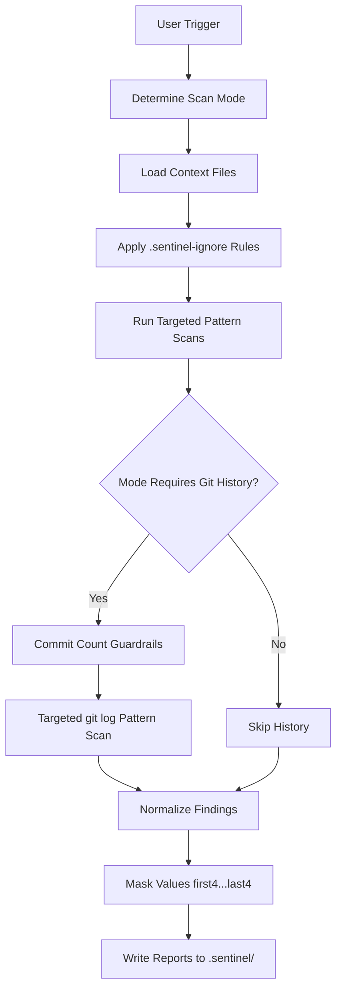

# Sentinel-Scan

[](#)
[](#reporting-contract)
[](#security-and-safety-guardrails)

A production-ready secret detection skill for repository security reviews.

Sentinel-Scan helps you identify leaked credentials in the working tree and (optionally) git history, then generates remediation-focused reports in `.sentinel/`.

## Ecosystem Integration

Sentinel-Scan is designed to pair with [codebase-indexer](https://github.com/Elvis020/codebase-indexer) for context-aware targeting. When `.codebase-indexer/docs/` is present, Sentinel uses indexer-generated architecture and implementation context to prioritize high-risk files and reduce scan noise.

## Why Sentinel-Scan

Most secret scans fail in one of two ways: too noisy to trust, or too shallow to catch real exposure. Sentinel-Scan is designed to balance both:

- Curated, high-signal detectors for common credential types
- Targeted scan strategy guided by project context (`.codebase-indexer/docs/`)
- Explicit severity model (`CRITICAL`, `HIGH`, `MEDIUM`, `LOW`)
- Built-in suppression workflow via `.sentinel-ignore`
- Strict masking policy so raw secrets are never printed

## Core Capabilities

- Scans high-risk files (`.env*`, credential/config paths, indexer-identified files)
- Supports three scan modes:
  - `quick`: fast, focused scan over high-value files
  - `full`: working tree scan plus optional git history checks
  - `git-history`: commit-history-centric investigation
- Applies commit-count guardrails before deep history scans
- Produces structured markdown reports for triage and remediation
- Includes a project-type prioritizer script for detector ordering

## Architecture



## Repository Layout

```text
.
├── SKILL.md                    # Main skill definition and execution rules
├── guides/
│   ├── scan-workflow.md        # End-to-end scanning workflow
│   ├── patterns.md             # Curated detector patterns
│   └── report-format.md        # Required report schema and masking contract
├── scripts/
│   └── pattern-prioritizer.py  # Project-shape-based detector prioritization
└── templates/
    ├── security-report.md      # Security summary template
    ├── secrets-found.md        # Detailed finding template
    └── remediation.md          # Guided remediation template
```

## Quick Start

### 1) Install / include the skill

Place this repository where your coding agent can load `SKILL.md` as a reusable skill.

### 2) Trigger a scan

Use natural prompts like:

- `scan for secrets`
- `quick secret scan`
- `run security audit`
- `scan git history for leaked keys`

### 3) Review generated outputs

Sentinel-Scan writes to `.sentinel/`:

- `.sentinel/security.md`
- `.sentinel/secrets-found.md` (only when findings exist)
- `.sentinel/remediation.md` (only when findings exist)

### Optional: pair with codebase-indexer first

For best signal quality on large repositories, run [codebase-indexer](https://github.com/Elvis020/codebase-indexer) first so Sentinel-Scan can consume:

- `.codebase-indexer/docs/architecture.md`
- `.codebase-indexer/docs/implementation.md`

## Scan Modes

| Mode | Typical Trigger | Coverage |
|---|---|---|
| `quick` | "quick scan", "fast scan" | High-value files only |
| `full` | "scan for secrets", "security audit", "rescan" | Working tree + targeted context + optional history |
| `git-history` | "scan commits", "check git history" | Commit history focused |

## Security and Safety Guardrails

- `.sentinel-ignore` is applied before reporting
- `.codebase-indexer/docs/architecture.md` and `implementation.md` are used for scan targeting when present
- Detector commands should be executable and validated (`rg --pcre2` recommended)
- History scanning is constrained by repo size:
  - `>500` commits: prefer targeted history scans
  - `>2000` commits: require explicit confirmation before full patch-history scan
- Secret values are always masked as `first4...last4`
- Raw credential values must never be written to output

## Reporting Contract

Minimum finding schema:

- `id`
- `severity`
- `file`
- `line`
- `detector`
- `masked_value`
- `status` (`active` or `suppressed`)

Severity levels:

- `CRITICAL`: likely active secret in tracked/deploy-impacting files
- `HIGH`: likely active or historically exposed credential artifact
- `MEDIUM`: credential-like value requiring manual validation
- `LOW`: suppressed or low-confidence placeholder-like finding

## Pattern Coverage

Sentinel-Scan prioritizes high-confidence credential patterns, including:

- OpenAI/Anthropic-style keys
- GitHub PATs
- AWS access keys
- Stripe keys
- Private key headers
- Connection strings
- JWT-like tokens
- Context-anchored generic secret assignments

See `guides/patterns.md` for pattern details and false-positive controls.

## Optional Utility Script

Use the prioritizer to adapt detector order to project shape:

```bash
python3 scripts/pattern-prioritizer.py .
```

Example output:

```json
{
  "project_path": ".",
  "detected_categories": ["node", "docker"],
  "priorities": {
    "critical": ["aws", "dockerhub", "gcp", "github", "openai", "stripe"],
    "high": ["database", "registry_auth", "sendgrid", "slack"]
  }
}
```

## Recommended Team Workflow

1. Run `quick` scan on every major branch before PR.
2. Run `full` scan before release.
3. Run `git-history` after incidents or when onboarding legacy repositories.
4. Rotate any exposed keys immediately and document remediation outcomes.
5. Add preventive controls (pre-commit checks + CI secret scanning).

## AppSec Playbook (Audience: Security Engineers)

Use this runbook when Sentinel-Scan is part of a standard secure SDLC process.

1. Run `quick` on PR branches as a lightweight gate.
2. Run `full` before release branches are cut.
3. Run `git-history` during incident response and after credential leak reports.
4. Triage findings by `CRITICAL` and `HIGH` first, then verify `MEDIUM`.
5. Execute immediate key rotation for active exposures.
6. Track MTTR and repeat-findings rate as core metrics.

Suggested operational controls:

- Add Sentinel scans to CI as a required check.
- Auto-create security tickets from `.sentinel/security.md`.
- Maintain owner mapping per detector family (cloud, SCM, payments, DB).

## Enterprise Compliance Profile (Audience: Governance / Audit Teams)

Sentinel-Scan can support internal controls where evidence of detection and remediation is required.

Control-aligned usage:

- **Preventive control:** pre-commit and PR-time scans (`quick`)
- **Detective control:** scheduled release scans (`full`) and historical validation (`git-history`)
- **Corrective control:** documented rotation and cleanup steps in `.sentinel/remediation.md`
- **Evidence artifacts:** retain `.sentinel/security.md` and related remediation records in your audit trail

Governance recommendations:

- Define policy SLAs by severity (`CRITICAL` same day, `HIGH` within defined window).
- Require sign-off for suppressed findings in `.sentinel-ignore`.
- Store scan artifacts with immutable timestamps in your compliance repository.
- Align remediation workflow with incident response ownership and escalation paths.

## Contributing

Contributions are welcome. High-value contribution areas:

- New high-signal detectors with low false-positive rates
- Better suppression ergonomics and path matching
- Performance tuning for large repositories
- Expanded remediation playbooks per provider

When adding patterns, preserve the masking contract and keep detector guidance executable.

## License

This project is licensed under the MIT License. See [LICENSE](LICENSE).
